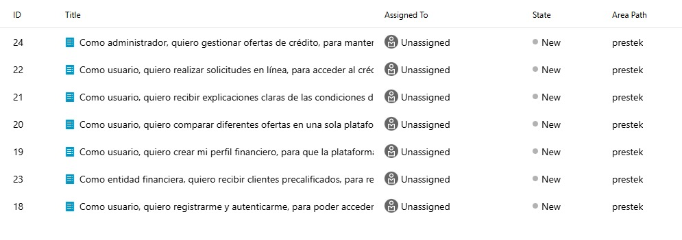
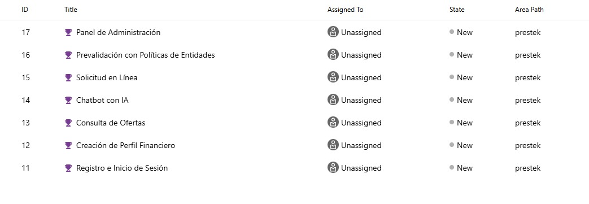
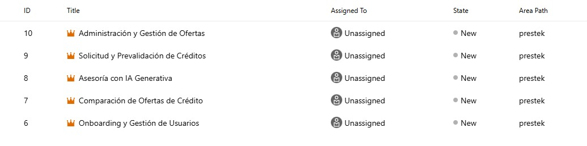
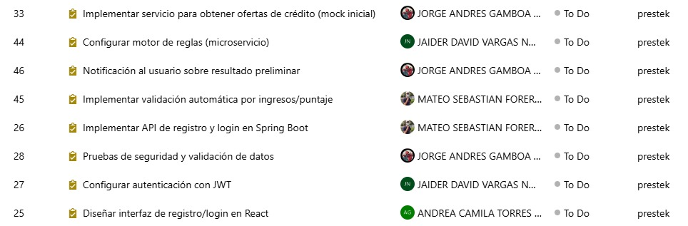
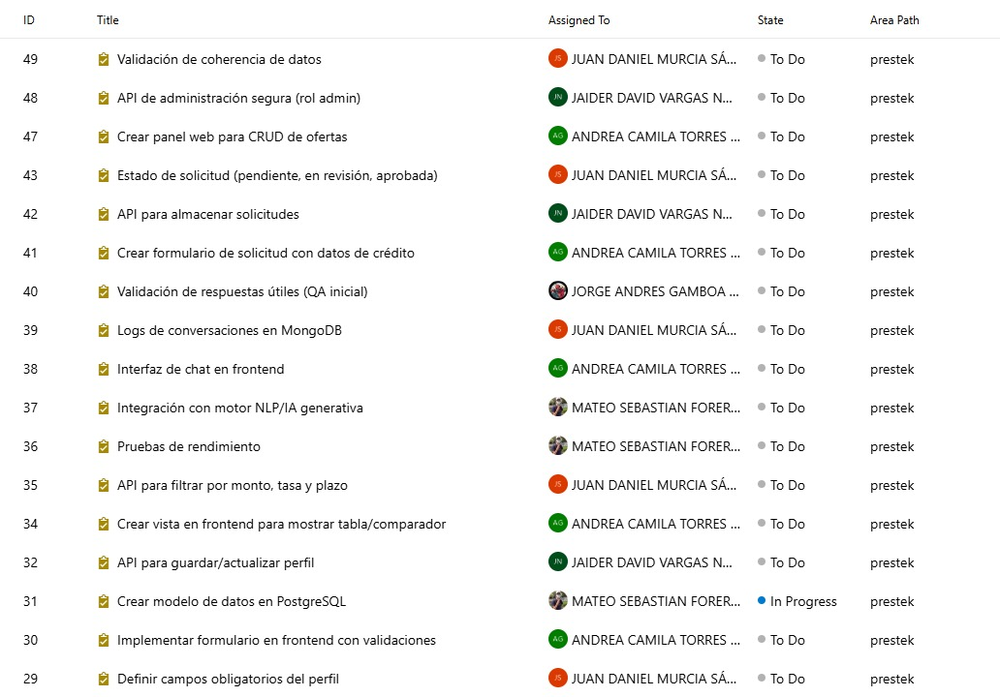
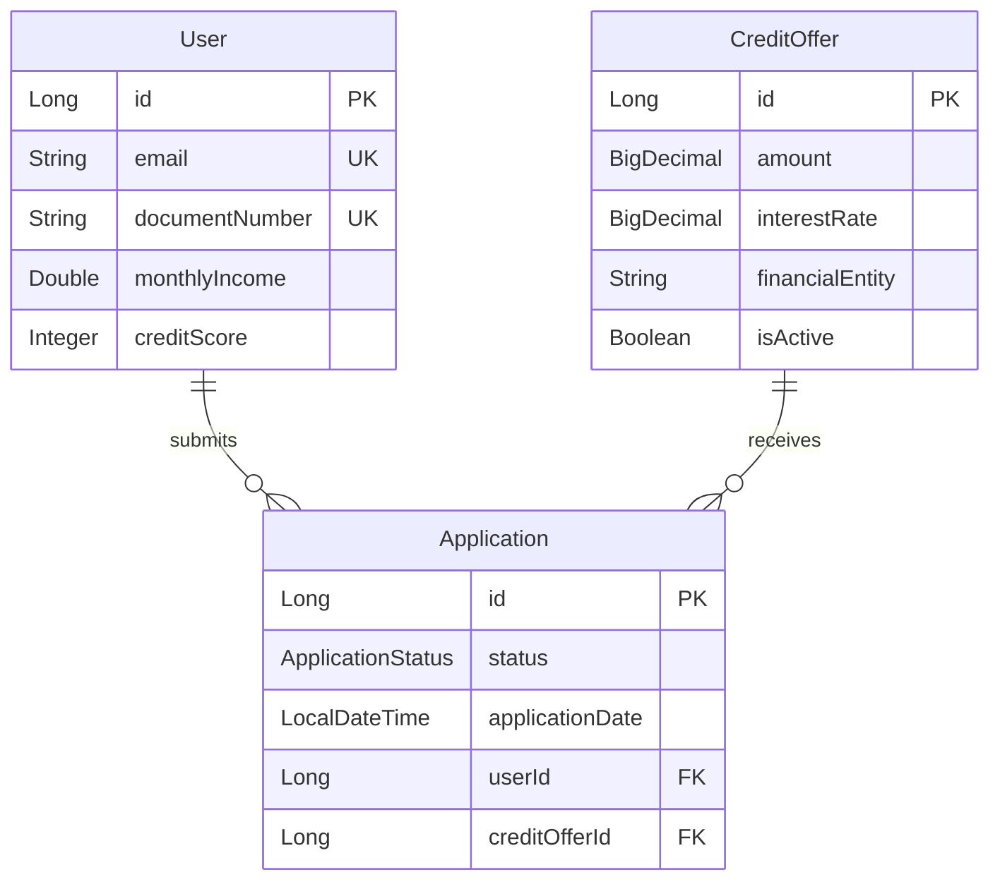

# PeopleService - Prestek Platform

**Microservicio de Gestión de Usuarios y Ofertas Crediticias**

El PeopleService es el núcleo del backend de la plataforma Prestek, encargado de gestionar usuarios, ofertas de crédito y solicitudes. Proporciona APIs completas para la administración del ecosistema crediticio digital.

---

## Descripción General

El PeopleService es el microservicio principal de la plataforma Prestek que gestiona:

- **Usuarios y perfiles financieros** completos
- **Ofertas de crédito** de múltiples entidades financieras
- **Solicitudes de crédito** con seguimiento de estados
- **APIs RESTful** completamente documentadas
- **Validaciones de negocio** integradas

Este microservicio actúa como:
- **Backend principal** para el frontend React
- **Proveedor de datos** para el AgentService
- **Centro de operaciones** crediticias
- **API Gateway** para entidades financieras

---

## Product Backlog

### Estructura del Proyecto







### Épica 1: Onboarding y Gestión de Usuarios

**Descripción:** Permitir que los usuarios se registren, creen su perfil financiero y accedan de manera segura a la plataforma.

#### Feature 1.1: Registro e Inicio de Sesión

**Historia de Usuario:** Como usuario, quiero registrarme y autenticarme, para poder acceder a la plataforma.

**Tareas:**
- Diseñar interfaz de registro/login en React
- Implementar API de registro y login en Spring Boot
- Configurar autenticación con JWT
- Pruebas de seguridad y validación de datos

**Estado:** En progreso
**Prioridad:** Alta
**Estimación:** 8 puntos

#### Feature 1.2: Creación de Perfil Financiero

**Historia de Usuario:** Como usuario, quiero crear mi perfil financiero, para que la plataforma me muestre ofertas personalizadas.

**Tareas:**
- Definir campos obligatorios del perfil (ingresos, empleo, etc.)
- Implementar formulario en frontend con validaciones
- Crear modelo de datos en PostgreSQL
- API para guardar/actualizar perfil

**Estado:** Completado
**Prioridad:** Alta
**Estimación:** 5 puntos

### Épica 2: Comparación de Ofertas de Crédito

**Descripción:** Brindar a los usuarios la posibilidad de consultar y comparar múltiples ofertas en tiempo real.

#### Feature 2.1: Consulta de Ofertas

**Historia de Usuario:** Como usuario, quiero comparar diferentes ofertas en una sola plataforma, para elegir la más conveniente.

**Tareas:**
- Implementar servicio para obtener ofertas de crédito (mock inicial)
- Crear vista en frontend para mostrar tabla/comparador
- API para filtrar por monto, tasa y plazo
- Pruebas de rendimiento (<2s por consulta)

**Estado:** Completado
**Prioridad:** Alta
**Estimación:** 8 puntos

### Épica 3: Asesoría con IA Generativa

**Descripción:** Incorporar un asistente digital que explique condiciones en lenguaje sencillo y resuelva dudas.

#### Feature 3.1: Chatbot con IA

**Historia de Usuario:** Como usuario, quiero recibir explicaciones claras de las condiciones del crédito, para entender costos y riesgos.

**Tareas:**
- Integración con motor NLP/IA generativa
- Interfaz de chat en frontend
- Logs de conversaciones en MongoDB
- Validación de respuestas útiles (QA inicial)

**Estado:** Pendiente
**Prioridad:** Media
**Estimación:** 13 puntos

### Épica 4: Solicitud y Prevalidación de Créditos

**Descripción:** Facilitar que los usuarios soliciten créditos y que los agentes de IA apliquen reglas de las entidades financieras.

#### Feature 4.1: Solicitud en Línea

**Historia de Usuario:** Como usuario, quiero realizar solicitudes en línea, para acceder al crédito sin trámites presenciales.

**Tareas:**
- Crear formulario de solicitud con datos de crédito
- API para almacenar solicitudes
- Estado de solicitud (pendiente, en revisión, aprobada)

**Estado:** Completado
**Prioridad:** Alta
**Estimación:** 5 puntos

#### Feature 4.2: Prevalidación con Políticas de Entidades

**Historia de Usuario:** Como entidad financiera, quiero recibir clientes precalificados, para reducir tiempo y costos.

**Tareas:**
- Configurar motor de reglas (microservicio)
- Implementar validación automática por ingresos/puntaje
- Notificación al usuario sobre resultado preliminar

**Estado:** En progreso
**Prioridad:** Alta
**Estimación:** 8 puntos

### Épica 5: Administración y Gestión de Ofertas

**Descripción:** Dar herramientas al administrador para gestionar las ofertas que se muestran en la plataforma.

#### Feature 5.1: Panel de Administración

**Historia de Usuario:** Como administrador, quiero gestionar ofertas de crédito, para mantener información actualizada.

**Tareas:**
- Crear panel web para CRUD de ofertas
- API de administración segura (rol admin)
- Validación de coherencia de datos

**Estado:** Pendiente
**Prioridad:** Media
**Estimación:** 8 puntos

### Resumen del Sprint Actual

| Estado | Features | Puntos | Porcentaje |
|--------|----------|--------|------------|
| Completado | 3 | 18 | 40% |
| En Progreso | 2 | 16 | 36% |
| Pendiente | 2 | 21 | 47% |
| **Total** | **7** | **55** | **100%** |

### Criterios de Aceptación Generales

- Todas las APIs deben estar documentadas en Swagger
- Cobertura de tests mínima del 80%
- Tiempo de respuesta menor a 2 segundos
- Validación de datos en frontend y backend
- Logs estructurados para auditoría
- Manejo de errores consistente

---

## Características

### Funcionalidades Implementadas

#### Gestión de Usuarios
- CRUD completo de usuarios
- Perfiles financieros (ingresos, gastos, score crediticio)
- Validación de datos únicos (email, documento)
- Búsqueda por email y documento
- Timestamps automáticos de auditoría

#### Gestión de Ofertas de Crédito
- CRUD completo de ofertas
- Filtrado por entidad financiera
- Búsqueda por rango de montos
- Estado activo/inactivo
- Gestión de tasas de interés y plazos

#### Gestión de Solicitudes
- Creación y seguimiento de aplicaciones
- Estados de workflow completo
- Relaciones entre usuarios y ofertas
- Notas y razones de rechazo
- Métricas de solicitudes por usuario

#### Características Técnicas
- APIs REST completamente documentadas
- Swagger/OpenAPI integrado
- Validaciones de entrada robustas
- Manejo de errores estructurado
- Logging detallado
- CORS configurado
- DTOs para transferencia de datos
- [Product Backlog](#-product-backlog)
- [Características](#-características)
- [Arquitectura](#-arquitectura)
- [Tecnologías](#-tecnologías)
- [Modelo de Datos](#-modelo-de-datos)
- [Instalación y Ejecución](#-instalación-y-ejecución)
- [API Documentation](#-api-documentation)
- [Variables de Entorno](#-variables-de-entorno)
- [Ejemplos de Uso](#-ejemplos-de-uso)
- [Testing](#-testing)
- [Docker](#-docker)
- [Contribución](#-contribución)stek Platform

**Microservicio de Gestión de Usuarios y Ofertas Crediticias**

El PeopleService es el núcleo del backend de la plataforma Prestek, encargado de gestionar usuarios, ofertas de crédito y solicitudes. Proporciona APIs completas para la administración del ecosistema crediticio digital.

---

##  Tabla de Contenidos

- [Descripción General](#-descripción-general)
- [Características](#-características)
- [Arquitectura](#-arquitectura)
- [Tecnologías](#-tecnologías)
- [Modelo de Datos](#-modelo-de-datos)
- [Instalación y Ejecución](#-instalación-y-ejecución)
- [API Documentation](#-api-documentation)
- [Variables de Entorno](#-variables-de-entorno)
- [Ejemplos de Uso](#-ejemplos-de-uso)
- [Testing](#-testing)
- [Docker](#-docker)
- [Contribución](#-contribución)

---

##  Descripción General

El PeopleService es el microservicio principal de la plataforma Prestek que gestiona:

- **Usuarios y perfiles financieros** completos
- **Ofertas de crédito** de múltiples entidades financieras
- **Solicitudes de crédito** con seguimiento de estados
- **APIs RESTful** completamente documentadas
- **Validaciones de negocio** integradas

### Propósito en el Ecosistema

Este microservicio actúa como:
- **Backend principal** para el frontend React
- **Proveedor de datos** para el AgentService
- **Centro de operaciones** crediticias
- **API Gateway** para entidades financieras

---

##  Características

###  Funcionalidades Implementadas

####  Gestión de Usuarios
-  CRUD completo de usuarios
-  Perfiles financieros (ingresos, gastos, score crediticio)
-  Validación de datos únicos (email, documento)
-  Búsqueda por email y documento
-  Timestamps automáticos de auditoría

####  Gestión de Ofertas de Crédito
-  CRUD completo de ofertas
-  Filtrado por entidad financiera
-  Búsqueda por rango de montos
-  Estado activo/inactivo
-  Gestión de tasas de interés y plazos

####  Gestión de Solicitudes
-  Creación y seguimiento de aplicaciones
-  Estados de workflow completo
-  Relaciones entre usuarios y ofertas
-  Notas y razones de rechazo
-  Métricas de solicitudes por usuario

####  Características Técnicas
-  APIs REST completamente documentadas
-  Swagger/OpenAPI integrado
-  Validaciones de entrada robustas
-  Manejo de errores estructurado
-  Logging detallado
-  CORS configurado
-  DTOs para transferencia de datos

---

##  Arquitectura

```
PeopleService (Port: 8080)
├──  REST Controllers
│   ├── UserController
│   ├── CreditOfferController
│   └── ApplicationController
├──  Service Layer
│   ├── UserService
│   ├── CreditOfferService
│   └── ApplicationService
├──  Repository Layer
│   ├── UserRepository
│   ├── CreditOfferRepository
│   └── ApplicationRepository
├──  Data Model
│   ├── User Entity
│   ├── CreditOffer Entity
│   └── Application Entity
└──  DTOs
    ├── UserDto
    ├── CreditOfferDto
    └── ApplicationDto
```
---

##  Tecnologías

| Categoría | Tecnología | Versión | Estado |
|-----------|------------|---------|--------|
| **Framework** | Spring Boot | 3.5.5 |
| **Java** | OpenJDK | 21 |
| **Base de Datos** | PostgreSQL | 15+ |
| **ORM** | JPA/Hibernate | 6.x |
| **Documentación** | SpringDoc OpenAPI | 2.8.9 |
| **Validación** | Bean Validation | 3.x |
| **Build Tool** | Maven | 3.9+ |
| **Logging** | SLF4J + Logback |
| **Testing** | JUnit 5 + Mockito |
| **Utils** | Lombok | 1.18+ |

---

##  Modelo de Datos

### Entidades Principales

####  User (Usuario)
```java
User {
    Long id                    
    String firstName           
    String lastName            
    String email              
    String phone              
    String documentNumber     
    Double monthlyIncome      
    Double monthlyExpenses    
    Integer creditScore       
    String employmentStatus   
    LocalDateTime createdAt   
    LocalDateTime updatedAt   
    List<Application> applications 
}
```

####  CreditOffer (Oferta de Crédito)
```java
CreditOffer {
    Long id                    
    BigDecimal amount         
    BigDecimal interestRate   
    Integer termMonths        
    String financialEntity    
    String description        
    String requirements       
    Boolean isActive          
    LocalDateTime createdAt   
    LocalDateTime updatedAt   
    List<Application> applications 
}
```

####  Application (Solicitud)
```java
Application {
    Long id                    
    ApplicationStatus status   
    LocalDateTime applicationDate  
    LocalDateTime reviewDate      
    LocalDateTime approvalDate    
    String notes              
    String rejectionReason    
    LocalDateTime createdAt   
    LocalDateTime updatedAt   
    User user                 
    CreditOffer creditOffer   
}
```

### Estados de Solicitud

```java
enum ApplicationStatus {
    PENDING,        
    UNDER_REVIEW,   
    APPROVED,       
    REJECTED,       
    CANCELLED       
}
```

### Relaciones



---

##  Instalación y Ejecución

### Prerrequisitos

- **Java 21** o superior
- **Maven 3.9+**
- **PostgreSQL 15+**
- **Git**

### 1. Configuración de Base de Datos

```sql
CREATE DATABASE prestek_people;

CREATE USER prestek_user WITH PASSWORD 'prestek_password';
GRANT ALL PRIVILEGES ON DATABASE prestek_people TO prestek_user;

\c prestek_people
CREATE SCHEMA people_service;
GRANT ALL ON SCHEMA people_service TO prestek_user;
```

### 2. Clonar y Configurar

```bash
git clone https://github.com/Prestek/PeopleService.git
cd PeopleService

cp .env.example .env
```

### 3. Variables de Entorno

Crear archivo `.env`:

```env
# Database Configuration
DB_URL=jdbc:postgresql://localhost:5432/prestek_people
DB_USERNAME=prestek_user
DB_PASSWORD=prestek_password
DB_SCHEMA=people_service

# CORS Configuration
ALLOWED_ORIGINS_HTTP=http://localhost:3000,http://localhost:3001
ALLOWED_ORIGINS_HTTPS=https://localhost:3000

# Server Configuration
SERVER_PORT=8080
```

### 4. Ejecutar la Aplicación

```bash
mvn clean compile

mvn test

mvn spring-boot:run

./m vnw spring-boot:run
```

### 5. Verificar Instalación

- **API Base**: http://localhost:8080
- **Swagger UI**: http://localhost:8080/swagger-ui.html
- **API Docs**: http://localhost:8080/api-docs
- **Health Check**: http://localhost:8080/actuator/health

---

##  API Documentation

###  Usuarios API

| Método | Endpoint | Descripción | Response |
|--------|----------|-------------|----------|
| `GET` | `/api/users` | Obtener todos los usuarios | `200 OK` |
| `GET` | `/api/users/{id}` | Obtener usuario por ID | `200 OK / 404 Not Found` |
| `GET` | `/api/users/email/{email}` | Obtener usuario por email | `200 OK / 404 Not Found` |
| `POST` | `/api/users` | Crear nuevo usuario | `201 Created / 400 Bad Request` |
| `PUT` | `/api/users/{id}` | Actualizar usuario | `200 OK / 404 Not Found` |
| `DELETE` | `/api/users/{id}` | Eliminar usuario | `204 No Content / 404 Not Found` |

###  Ofertas de Crédito API

| Método | Endpoint | Descripción | Response |
|--------|----------|-------------|----------|
| `GET` | `/api/credit-offers` | Obtener todas las ofertas | `200 OK` |
| `GET` | `/api/credit-offers/active` | Obtener ofertas activas | `200 OK` |
| `GET` | `/api/credit-offers/{id}` | Obtener oferta por ID | `200 OK / 404 Not Found` |
| `GET` | `/api/credit-offers/entity/{name}` | Ofertas por entidad financiera | `200 OK` |
| `GET` | `/api/credit-offers/amount-range` | Ofertas por rango de monto | `200 OK` |
| `POST` | `/api/credit-offers` | Crear nueva oferta | `201 Created` |
| `PUT` | `/api/credit-offers/{id}` | Actualizar oferta | `200 OK / 404 Not Found` |
| `PATCH` | `/api/credit-offers/{id}/deactivate` | Desactivar oferta | `200 OK / 404 Not Found` |
| `DELETE` | `/api/credit-offers/{id}` | Eliminar oferta | `204 No Content / 404 Not Found` |

###  Solicitudes API

| Método | Endpoint | Descripción | Response |
|--------|----------|-------------|----------|
| `GET` | `/api/applications` | Obtener todas las solicitudes | `200 OK` |
| `GET` | `/api/applications/{id}` | Obtener solicitud por ID | `200 OK / 404 Not Found` |
| `GET` | `/api/applications/user/{userId}` | Solicitudes por usuario | `200 OK` |
| `GET` | `/api/applications/credit-offer/{offerId}` | Solicitudes por oferta | `200 OK` |
| `GET` | `/api/applications/status/{status}` | Solicitudes por estado | `200 OK` |
| `GET` | `/api/applications/user/{userId}/count` | Contador de solicitudes | `200 OK` |
| `POST` | `/api/applications` | Crear nueva solicitud | `201 Created / 400 Bad Request` |
| `PATCH` | `/api/applications/{id}/status` | Actualizar estado | `200 OK / 404 Not Found` |
| `DELETE` | `/api/applications/{id}` | Eliminar solicitud | `204 No Content / 404 Not Found` |

---

##  Ejemplos de Uso

### Crear Usuario

```bash
curl -X POST http://localhost:8080/api/users \
  -H "Content-Type: application/json" \
  -d '{
    "firstName": "Juan",
    "lastName": "Pérez",
    "email": "juan.perez@email.com",
    "phone": "+57123456789",
    "documentNumber": "12345678",
    "monthlyIncome": 5000000,
    "monthlyExpenses": 3000000,
    "creditScore": 750,
    "employmentStatus": "EMPLOYED"
  }'
```

### Crear Oferta de Crédito

```bash
curl -X POST http://localhost:8080/api/credit-offers \
  -H "Content-Type: application/json" \
  -d '{
    "amount": 50000000,
    "interestRate": 12.5,
    "termMonths": 24,
    "financialEntity": "Banco Nacional",
    "description": "Crédito personal con tasa preferencial",
    "requirements": "Ingresos mínimos $2,000,000, Score crediticio > 600"
  }'
```

### Crear Solicitud de Crédito

```bash
curl -X POST http://localhost:8080/api/applications \
  -H "Content-Type: application/json" \
  -d '{
    "userId": 1,
    "creditOfferId": 1
  }'
```

### Actualizar Estado de Solicitud

```bash
curl -X PATCH http://localhost:8080/api/applications/1/status \
  -H "Content-Type: application/json" \
  -d '{
    "status": "APPROVED",
    "notes": "Solicitud aprobada después de verificación de ingresos"
  }'
```

### Buscar Ofertas por Rango

```bash
curl "http://localhost:8080/api/credit-offers/amount-range?minAmount=10000000&maxAmount=100000000"
```

---

### Estructura de Tests

```
src/test/java/
├── com/prestek/people/
│   ├── controller/          # Tests de controladores
│   │   ├── UserControllerTest.java
│   │   ├── CreditOfferControllerTest.java
│   │   └── ApplicationControllerTest.java
│   ├── service/             # Tests de servicios
│   │   ├── UserServiceTest.java
│   │   ├── CreditOfferServiceTest.java
│   │   └── ApplicationServiceTest.java
│   ├── repository/          # Tests de repositorios
│   │   ├── UserRepositoryTest.java
│   │   ├── CreditOfferRepositoryTest.java
│   │   └── ApplicationRepositoryTest.java
│   └── integration/         # Tests de integración
│       └── PeopleServiceIntegrationTest.java
```

### Ejecutar Tests

```bash
mvn test

mvn test -Dtest=UserServiceTest

mvn test -Dtest="com.prestek.people.controller.*"

mvn test -Dspring.profiles.active=test

mvn jacoco:report
```

### Configuración de Test

```yaml
spring:
  datasource:
    url: jdbc:h2:mem:testdb
    driver-class-name: org.h2.Driver
  jpa:
    hibernate:
      ddl-auto: create-drop
    show-sql: true
  test:
    database:
      replace: none
```

### Tests de Integración

```java
@SpringBootTest(webEnvironment = SpringBootTest.WebEnvironment.RANDOM_PORT)
@TestPropertySource(locations = "classpath:application-test.properties")
@AutoConfigureTestDatabase(replace = AutoConfigureTestDatabase.Replace.NONE)
class PeopleServiceIntegrationTest {
    
    @Autowired
    private TestRestTemplate restTemplate;
    
    @Test
    void shouldCreateUserAndApplication() {
    }
}
```

---

##  Docker

### Dockerfile

```dockerfile
FROM openjdk:21-jdk-slim

LABEL maintainer="prestek@example.com"
LABEL version="1.0.0"
LABEL description="PeopleService - Prestek Platform"

WORKDIR /app

COPY .mvn/ .mvn/
COPY mvnw pom.xml ./

RUN ./mvnw dependency:go-offline -B

COPY src ./src

RUN ./mvnw clean package -DskipTests

RUN groupadd -r prestek && useradd -r -g prestek prestek
USER prestek

EXPOSE 8080

HEALTHCHECK --interval=30s --timeout=10s --start-period=60s --retries=3 \
  CMD curl -f http://localhost:8080/actuator/health || exit 1

ENTRYPOINT ["java", "-jar", "target/people-service-0.0.1-SNAPSHOT.jar"]
```

### Docker Compose

```yaml
version: '3.8'

services:
  people-service:
    build: .
    ports:
      - "8080:8080"
    environment:
      - DB_URL=jdbc:postgresql://postgres:5432/prestek_people
      - DB_USERNAME=prestek
      - DB_PASSWORD=password
      - DB_SCHEMA=people_service
    depends_on:
      postgres:
        condition: service_healthy
    networks:
      - prestek-network

  postgres:
    image: postgres:15-alpine
    environment:
      POSTGRES_DB: prestek_people
      POSTGRES_USER: prestek
      POSTGRES_PASSWORD: password
    ports:
      - "5432:5432"
    volumes:
      - postgres_data:/var/lib/postgresql/data
      - ./init.sql:/docker-entrypoint-initdb.d/init.sql
    healthcheck:
      test: ["CMD-SHELL", "pg_isready -U prestek"]
      interval: 10s
      timeout: 5s
      retries: 5
    networks:
      - prestek-network

  adminer:
    image: adminer
    ports:
      - "8090:8080"
    networks:
      - prestek-network

volumes:
  postgres_data:

networks:
  prestek-network:
    driver: bridge
```

### Ejecutar con Docker

```bash
docker build -t prestek/people-service .

docker-compose up -d

docker-compose logs -f people-service

docker-compose down

docker-compose down -v
```

---

##  Monitoring y Observabilidad

### Actuator Endpoints

| Endpoint | Descripción |
|----------|-------------|
| `/actuator/health` | Estado de salud |
| `/actuator/info` | Información de la aplicación |
| `/actuator/metrics` | Métricas de la aplicación |
| `/actuator/loggers` | Configuración de logging |
| `/actuator/env` | Variables de entorno |

---

**Prestek Team** © 2024 - Revolucionando el acceso al crédito en América Latina 🚀

---